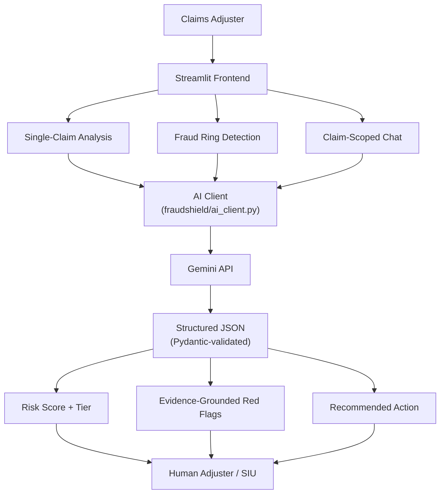
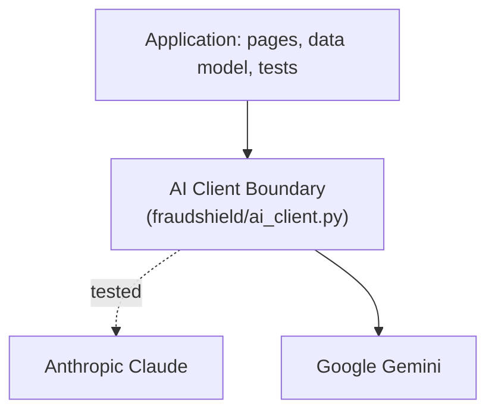
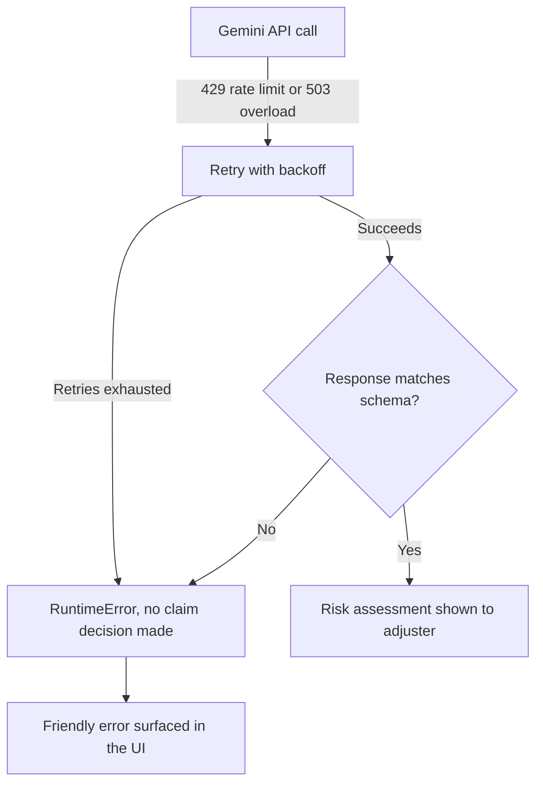
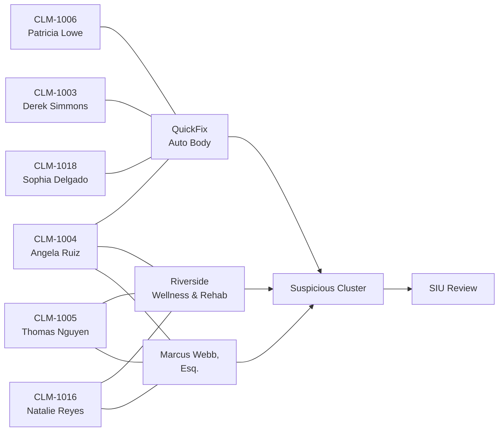
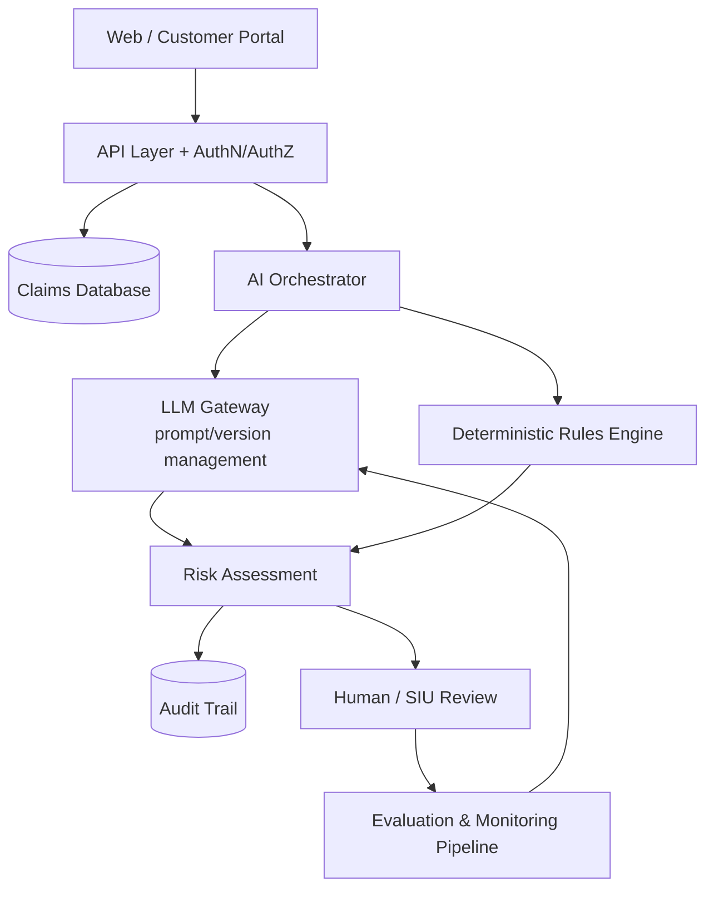

# 🛡️ FraudShield — AI-Powered Insurance Claims Fraud Detection

**Capstone Project — AI Practitioner+ Program**

**🔗 Live demo: [capstone-fraudshield.streamlit.app](https://capstone-fraudshield.streamlit.app/)**

FraudShield takes a real, well-scoped business problem — first-pass triage of insurance claims for
fraud — and works it end to end: a scoped AI workflow with grounding rules and structured output, a
cross-claim network-analysis feature no single-claim review would catch, retry/failure handling for a
flaky external dependency, an automated test suite, an evaluation harness against known outcomes, and an
explicit accounting of what it would take to move this from MVP to production.

> **Model provider.** This program's brief specifies Claude. The application was deliberately designed
> with provider isolation — every prompt, schema, and business rule lives independently of any one
> vendor's SDK, with all provider-specific code confined to a single module
> ([`fraudshield/ai_client.py`](fraudshield/ai_client.py)) behind an
> [LLM provider boundary](#architecture). That architecture was validated for real, not just claimed: the
> implementation was migrated from Anthropic Claude to Google Gemini without changing the application,
> schemas, or business logic anywhere else. **The live demo currently runs on Gemini** via the
> `google-genai` SDK.

## Contents

[Business problem](#the-business-problem) · [What it does](#what-it-does) ·
[Engineering decisions](#key-engineering-decisions) · [Architecture](#architecture) ·
[AI guardrails](#ai-guardrails) · [Failure handling](#failure-handling) ·
[Fraud ring detection](#fraud-ring-detection) ·
[Testing & evaluation](#engineering-quality-testing--evaluation) · [Setup](#setup) ·
[Demo flow](#suggested-demo-flow) · [Limitations](#responsible-use--limitations) ·
[Production path](#from-mvp-to-production)

## The business problem

Fraud is one of the fastest-growing loss drivers in insurance, amplified by digital channels, staged
accidents, inflated repair bills, identity abuse, and organized fraud rings. Traditional rule-based
checks alone are insufficient and reactive: they catch yesterday's fraud patterns while adding friction
for the vast majority of genuine policyholders.

**What this MVP actually delivers today:** it reduces the manual effort of first-pass claim triage by
generating a structured risk assessment, evidence-backed red flags, and a recommended next action
immediately after a claim is submitted — work that would otherwise sit in a generic review queue.

**What a production deployment would be measured on** (not claimed here, since there's no production
traffic to measure against): average claim triage time, investigator cases reviewed per day, high-risk
precision, false-positive rate, SIU referral rate, and average investigation cost. The
[evaluation](#engineering-quality-testing--evaluation) section below reports the closest proxy available
at this stage — agreement against a known synthetic ground truth — rather than inventing ROI figures.

## What it does

| Feature | Description |
|---|---|
| **Claims Dashboard** | KPI overview, risk distribution and claimed-amount charts, a filterable/searchable claims table, and a drill-down view per claim with the full AI assessment. |
| **Live claim analysis** | Every claim gets a 0–100 risk score, a risk tier (Low/Medium/High), specific red flags with severity and explanation, a recommended action (Approve / Request More Info / Investigate / Escalate to SIU), and a confidence level — all as structured, auditable output, not free-text guesswork. |
| **Submit a New Claim** | A live demo path: fill out a claim (or one-click a "clean" or "suspicious" example) and get an instant AI-generated risk assessment. |
| **Fraud Ring Detection** | A network-analysis pass across the entire claims book that surfaces claims linked by shared repair shops, clinics, attorneys, or addresses — the pattern behind organized/staged-accident fraud rings — that no single-claim review would catch. |
| **Ask FraudShield** | A claim-scoped chat so an adjuster can ask follow-up questions ("why wasn't X a bigger factor?") and get an answer grounded in that claim's file and assessment. |

Every recommendation is explicitly framed as **decision support**, not a final determination — a human
adjuster or investigator always makes the call. This is stated directly to the model in the system prompt.

## Key Engineering Decisions

**1. Structured AI output instead of free-form responses.** Every assessment is constrained by a Pydantic
schema (`FraudAssessment` / `RingFindings`) passed to Gemini's controlled generation. The app never parses
free text or hopes for well-formatted JSON — it gets a validated object back every time, so risk score,
tier, red flags, recommended action, and confidence are always safe to consume programmatically.

**2. Decision support, never automated decisions.** The model recommends an action; it does not approve,
deny, or reject a claim. That boundary is enforced in the system prompt itself (see
[AI Guardrails](#ai-guardrails)), not just in surrounding application code.

**3. Single-claim analysis + cross-claim analysis, as two distinct passes.** Reasoning about one claim in
isolation and reasoning about relationships across a claims book are different problems with different
prompts and different schemas ([`analyze_claim`](fraudshield/ai_client.py) vs.
[`detect_fraud_rings`](fraudshield/ai_client.py)) — collapsing them into one call would make the ring
signal noisy and the single-claim reasoning slower.

**4. Cached baseline analysis.** Seed claims use pre-computed assessments (`data/analysis_cache.json`)
generated once via [`scripts/precompute_analysis.py`](scripts/precompute_analysis.py), so the dashboard
stays responsive and deterministic during a demo instead of depending on live API latency for every page
view. Live re-analysis and new-claim submission still hit the API in real time.

**5. Provider abstraction.** All Gemini-specific code is isolated inside `fraudshield/ai_client.py`. The
rest of the app — data model, UI, validation, tests — has no knowledge of which model provider is behind
`analyze_claim()` and `detect_fraud_rings()`. This was validated in practice, not just claimed: see the
model-provider note above.

**6. Why AI reasoning instead of a rules engine.** A rule like `policy_age < 30 days AND no_police_report
→ HIGH RISK` is deterministic but brittle — it only catches fraud patterns someone already thought to
encode, and can't weigh context (a severe accident isn't suspicious; a minor one with five red flags is).
FraudShield instead gives the model the full claim narrative — policy age, police report, witnesses,
prior claims, the incident description, repair provider, mitigating evidence — and asks it to reason
about the combination the way an investigator would, then return that reasoning as structured, auditable
output rather than an opaque score. Rules aren't abandoned, though: [the production
path](#from-mvp-to-production) pairs a deterministic rules engine alongside the AI orchestrator — rules
for the checks that should always fire the same way, AI for reasoning over the narrative that rules can't
capture.

## Architecture



**LLM provider boundary.** Everything above `fraudshield/ai_client.py` — the Streamlit pages, the data
model, validation, tests — has no knowledge of which model provider sits behind it:



Provider migration was validated by actually doing it, not just designing for it: the implementation
moved from Claude to Gemini without touching the application, schemas, or business logic.

```
capstone/
├── Home.py                          # Landing page / business case (Streamlit entrypoint)
├── pages/
│   ├── 1_Claims_Dashboard.py        # KPIs, charts, filterable table, claim drill-down + chat
│   ├── 2_Submit_New_Claim.py        # Live claim intake -> instant AI analysis
│   └── 3_Fraud_Ring_Detection.py    # Cross-claim network analysis
├── fraudshield/                     # Core backend package
│   ├── __init__.py                  # Loads .env / Streamlit secrets into os.environ
│   ├── ai_client.py                 # All LLM calls, schemas, prompts, retry/backoff
│   ├── data.py                      # Claim + cache persistence (JSON-backed)
│   └── ui.py                        # Shared styling, badges, color tokens
├── data/
│   ├── claims_seed.json             # 18 synthetic claims (clean, ambiguous, fraud-ring cases)
│   ├── analysis_cache.json          # Pre-computed Gemini assessments for the seed claims
│   └── ring_findings.json           # Pre-computed fraud-ring analysis
├── evaluation/                      # Ground-truth evaluation harness (see below)
│   ├── evaluation_cases.json
│   ├── evaluate.py
│   └── RESULTS.md                   # Output of the last evaluation run
├── scripts/
│   └── precompute_analysis.py       # One-time script that (re)generates the cache files
├── tests/                           # Pytest suite, mocked Gemini client, no network calls
│   ├── test_ai_client.py
│   ├── test_data.py
│   └── test_ui.py
├── requirements.txt
├── requirements-dev.txt             # + pytest
└── README.md
```

**Stack:** Python + [Streamlit](https://streamlit.io) (no separate frontend build step — this machine
didn't have Node.js available, and Streamlit gets a working, presentable UI shipped in a single day) +
the official `google-genai` SDK, using Gemini's controlled generation (`response_schema`) for structured
output.

**MVP trade-off, stated explicitly:** claim and assessment data are plain JSON files
(`fraudshield/data.py`) rather than a database. This was a deliberate choice to minimize infrastructure
and keep a one-day prototype deployable — not an oversight. It doesn't hold up under concurrent writers or
durable multi-user production use; see [From MVP to production](#from-mvp-to-production) for the
transactional persistent storage that would replace it.

## AI Guardrails

FraudShield is intentionally designed as decision support, not an autonomous decision-maker. These rules
are enforced directly in the system prompts in `fraudshield/ai_client.py`, not just described here:

1. **The model cannot make the final claim decision.** It recommends Approve / Request More Info /
   Investigate / Escalate to SIU; a human always makes the actual call.
2. **Red flags must be grounded in supplied claim facts.** The prompt explicitly forbids inventing
   details not present in the claim file.
3. **Mitigating evidence must be weighed, not just suspicious signals.** Police reports, independent
   witnesses, consistent documentation, and long clean policy history are meant to lower risk — even for
   large claims.
4. **Severe circumstances aren't automatically suspicious.** A serious accident or a large claim is not
   itself a red flag without an actual fraud indicator behind it.
5. **Structured output is schema-validated**, not trusted free text (see
   [Key Engineering Decisions](#key-engineering-decisions)).
6. **Provider/API failures are handled explicitly**, never silently — see [Failure Handling](#failure-handling).
7. **All data is synthetic**, built for this capstone. Production deployment would require fairness/bias
   evaluation, an audit trail, and a human-review workflow — see
   [Responsible use & limitations](#responsible-use--limitations).

## Failure Handling

The Gemini free tier is bursty in practice: rate limits (429) and transient server overload (503) showed
up regularly during development, so the client can't assume happy-path responses.



`_generate_with_retry` in `fraudshield/ai_client.py` retries 429s with linear backoff and 503s with
exponential backoff up to a max attempt count, then raises a clean `RuntimeError` rather than crashing the
page. A response that doesn't parse against the Pydantic schema is treated the same way as an API failure
— **external failures never fall through to an automated claim outcome; they surface as an explicit error
and no assessment is produced.** This behavior is unit tested (see
[Engineering Quality](#engineering-quality-testing--evaluation)) with a mocked client, not just asserted
here.

## Fraud Ring Detection

This is the standout feature relative to a typical AI-claims demo, which usually stops at *claim → LLM →
risk score*. FraudShield adds a second pass: *claims book → relationship analysis → fraud-ring detection*,
which is where individually-mild-looking claims turn out to be part of an organized pattern:



The seed dataset deliberately includes both a real ring (six claims sharing a repair shop, a clinic, and
an attorney across multiple claimants) and a **trap case** — two claims (`CLM-1008`, `CLM-1013`) that
share only an address, with no other suspicious link, to test whether the model over-flags coincidence as
collusion. The [evaluation results](#engineering-quality-testing--evaluation) below report exactly how
that trap resolved — not just that a ring-detection feature exists.

## Engineering Quality: Testing & Evaluation

**Automated tests** (`pytest`, 27 tests, all against a mocked Gemini client — no network access or real
API calls needed to run the suite):

- Claim, cache, and assessment persistence round-trips (`fraudshield/data.py`)
- UI formatting and status-badge mapping (`fraudshield/ui.py`)
- API retry/backoff on 429 rate limits and 503 server overload, giving up cleanly after max attempts,
  *not* retrying genuine 4xx errors like 404 (`fraudshield/ai_client.py`)
- Structured-response validation, including the failure path when a response doesn't match the schema

```
pip install -r requirements-dev.txt
python -m pytest tests/
```

**AI evaluation** (`evaluation/evaluate.py`) is a separate concern from unit tests: it checks whether the
AI's actual judgments agree with a known ground truth, run against the real cached outputs in
`data/analysis_cache.json` and `data/ring_findings.json`. The ground truth
(`evaluation/evaluation_cases.json`) was authored by the same person who designed the synthetic seed
claims — **that's disclosed here rather than presented as independent benchmarking**; for 18 synthetic
claims, the honest value is in surfacing disagreements, not producing an impressive-looking score.

```
python evaluation/evaluate.py
```

Latest run ([full output](evaluation/RESULTS.md)):

| Metric | Result |
|---|---|
| Structured output validity | **18/18 (100%)** |
| Risk-tier exact agreement | **16/18 (88.9%)** |
| Fraud-ring precision | **100%** |
| Fraud-ring recall | **100%** |
| Fraud-ring F1 | **100%** |

The ring-detection precision/recall is on **6 expected members in an 18-claim synthetic set** — a sanity
check, not a statistically meaningful sample, and it's reported as a ratio for exactly that reason rather
than rounded up to a headline "100% fraud detection" claim.

### Evaluation findings (reported, not tuned away)

Two claims disagreed with the design intent — both are the model rating a claim **Medium** where it was
designed to be **High**: an under-call, not the more dangerous failure mode of a High-designed claim
dropping to Low or a Low-designed claim getting bumped up.

| Claim | Expected | AI | Score | Finding |
|---|---|---|---|---|
| `CLM-1009` | High | Medium | 58 | Under-call — delayed theft report, no telematics, noted financial distress |
| `CLM-1014` | High | Medium | 68 | Under-call — high visit frequency at a new clinic, adjuster-flagged upcoding |

**Next engineering step** these two point to: check whether these cases need stronger prompt guidance
around financial-distress and billing-pattern indicators specifically, or whether they're better handled
by a deterministic rule feeding into the AI orchestrator (see [decision
6](#key-engineering-decisions)) rather than relying on narrative reasoning alone.

The ring detection correctly identified all six real ring members with zero false positives and zero
false negatives, and — the more interesting result — correctly did **not** flag the `CLM-1008` /
`CLM-1013` shared-address trap case as a ring. Full run output: [`evaluation/RESULTS.md`](evaluation/RESULTS.md).

## Setup

The live demo above requires no setup. To run it locally instead:

1. **Requirements:** Python 3.10+.
2. Install dependencies:
   ```
   pip install -r requirements.txt
   ```
3. Configure your API key:
   ```
   copy .env.example .env
   ```
   then edit `.env` and set `GEMINI_API_KEY=...` (a free key from [aistudio.google.com](https://aistudio.google.com/apikey)
   or [console.cloud.google.com](https://console.cloud.google.com) is enough to run this whole demo).
4. *(Optional but recommended)* Pre-generate assessments for the seed claims so the dashboard and fraud
   ring page load with real AI output immediately, instead of showing "not analyzed":
   ```
   python scripts/precompute_analysis.py
   ```
5. Run the app:
   ```
   python -m streamlit run Home.py
   ```
   Streamlit will open the app at `http://localhost:8501`.

Live features (the "Run live AI analysis" buttons, **Submit a New Claim**, and **Fraud Ring Detection**)
require a valid `GEMINI_API_KEY`; without one, the sidebar shows a warning and those actions display a
friendly error instead of crashing.

## Suggested demo flow

1. **Home** — business framing: the problem, how the pipeline works, and the real evaluation results
   (schema validity, risk-tier agreement, ring detection) rather than illustrative projections.
2. **Claims Dashboard** — show the KPI row and charts, then open a clean low-risk claim (e.g. `CLM-1007`)
   and a high-risk one (e.g. `CLM-1003` or `CLM-1018`) to contrast the reasoning and red flags.
3. **Submit a New Claim** — click "Load a suspicious claim example" (or type your own) and submit live,
   so the audience watches the AI generate a real assessment in seconds.
4. **Fraud Ring Detection** — run the live network analysis and show the claim cluster tied to
   *QuickFix Auto Body* / *Riverside Wellness & Rehab* / *Marcus Webb, Esq.* across multiple claimants —
   a pattern no single-claim review would surface.

## Responsible use & limitations

This is an MVP built for a one-day capstone, not a production underwriting system:

- All claim and claimant data in `data/claims_seed.json` is **synthetic**, invented for this demo.
- Risk scores are decision-support signals for a human adjuster, not automated denials or approvals.
- The Home page shows real evaluation metrics (schema validity, risk-tier agreement, ring detection) from
  this project's own 18-claim synthetic set, not measured results from a production deployment or an
  independent benchmark.
- The [evaluation](#engineering-quality-testing--evaluation) ground truth is self-authored against a
  synthetic dataset, not an independently labeled benchmark — treat it as a sanity check, not proof of
  production-grade accuracy.

## From MVP to production



Concretely, moving beyond this MVP would need:

- **Persistent storage** — a real database instead of flat JSON files, with claim history and case status.
- **AuthN/AuthZ** — role-based access (adjuster vs. SIU vs. admin), not an open Streamlit app.
- **Audit trail** — every AI recommendation and human decision logged and reviewable, not just displayed.
- **Model monitoring & evaluation pipeline** — the `evaluation/` harness here is a starting shape, not a
  finished one; production needs continuous evaluation against real (labeled) outcomes, drift detection,
  and prompt/version management as the model or prompts change.
- **Fairness/bias evaluation** — testing for disparate impact across protected classes before any
  AI-influenced signal reaches a real claims decision.
- **Document/image analysis** — damage photos vs. claimed repair scope, using the model's vision input.
- **Case management integration** — assigning flagged claims to an SIU investigator and feeding outcomes
  back into the evaluation loop, closing the loop this MVP currently leaves open.
